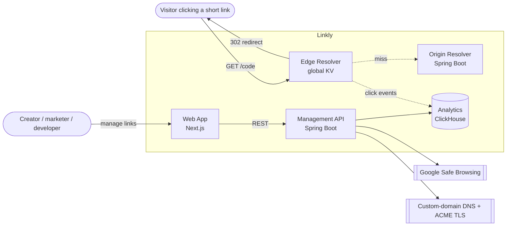
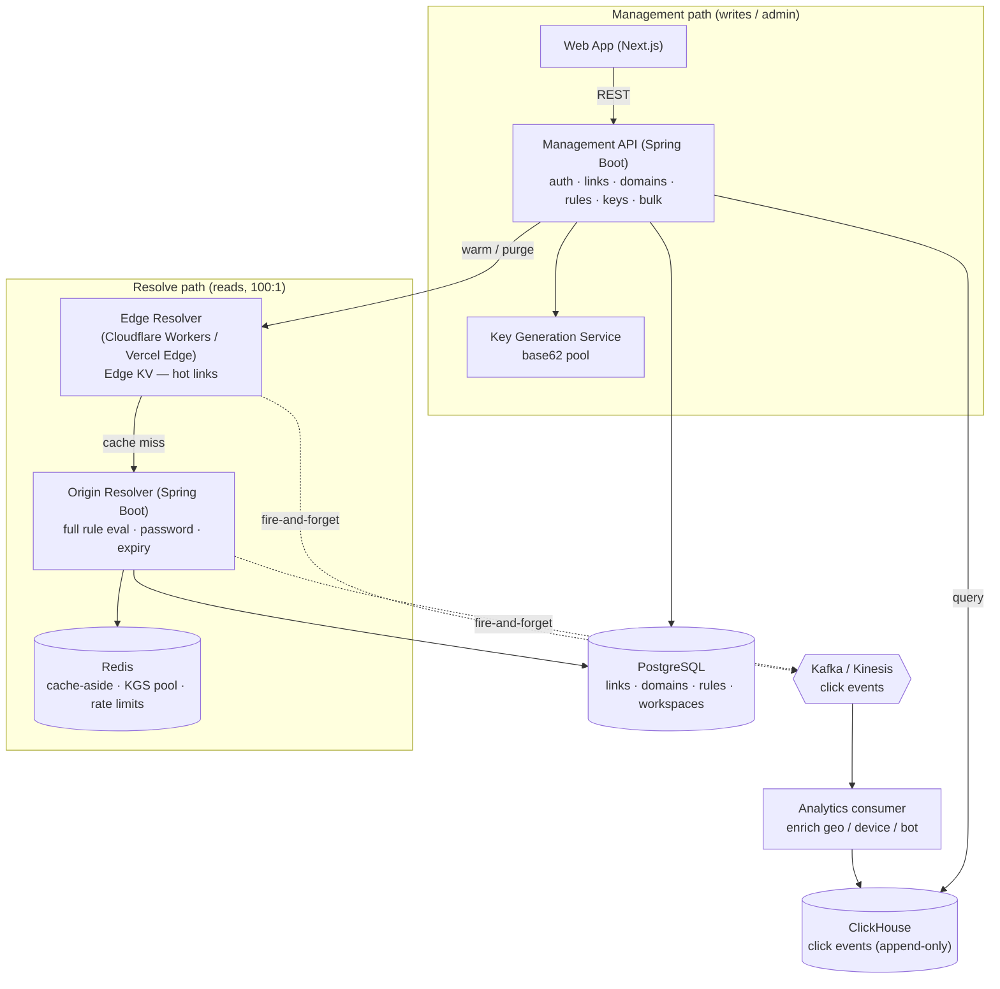
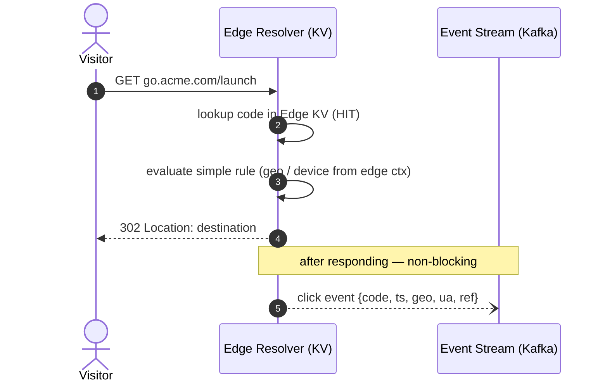
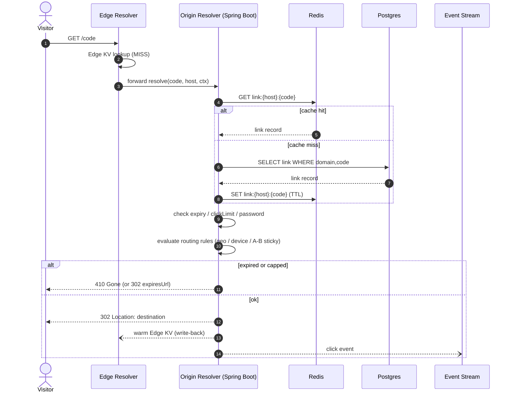
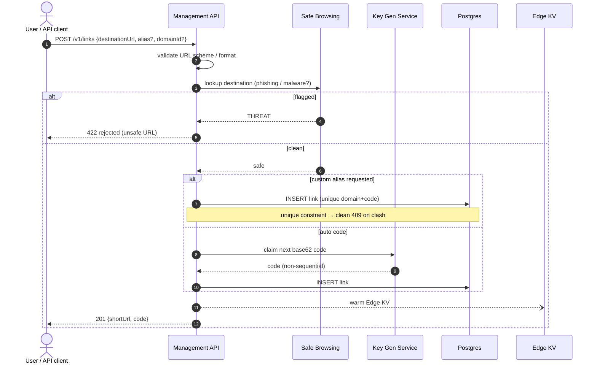
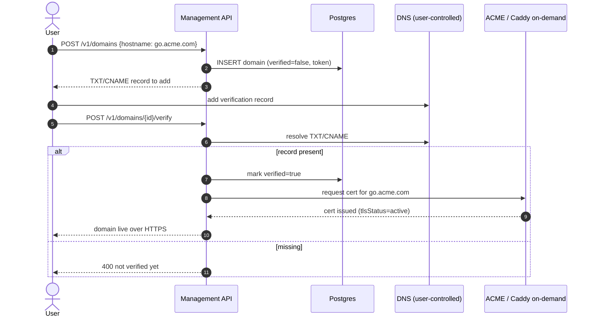
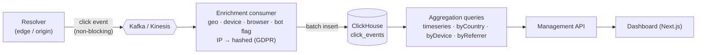
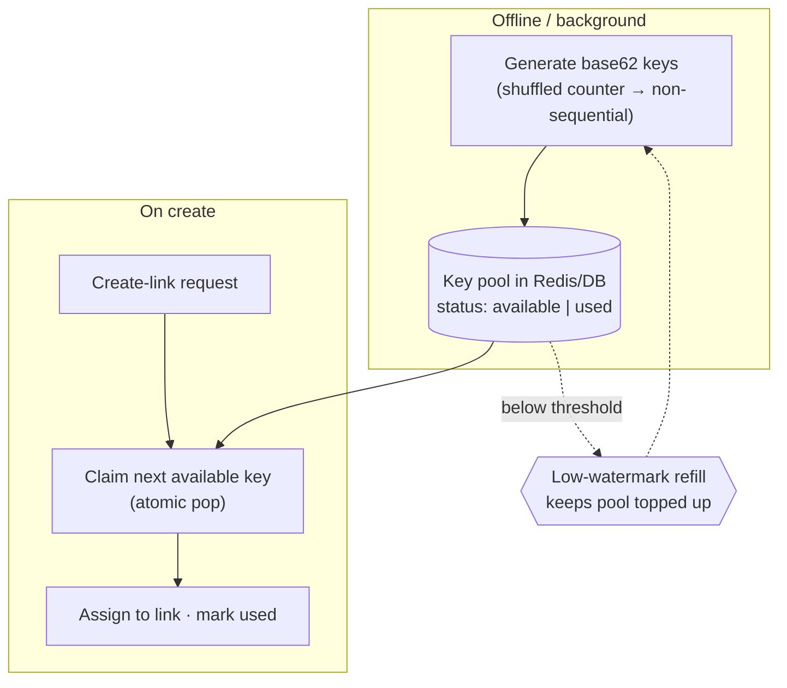
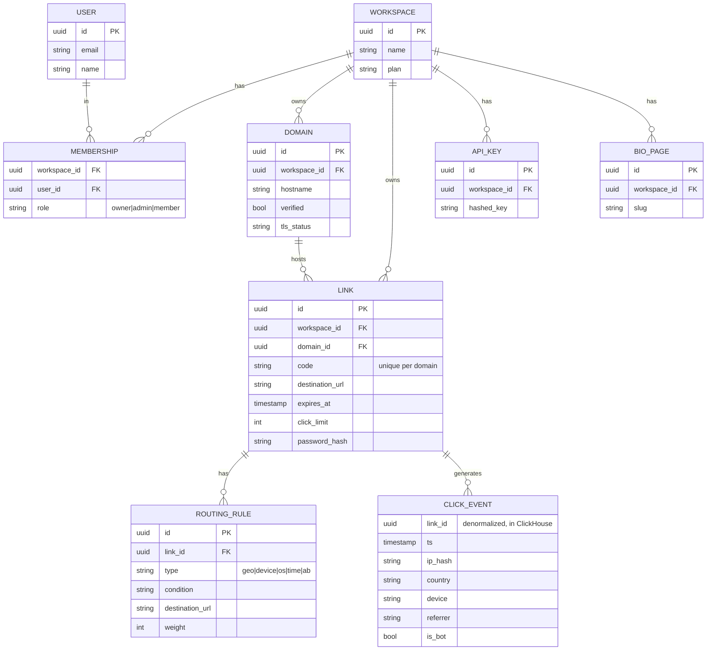
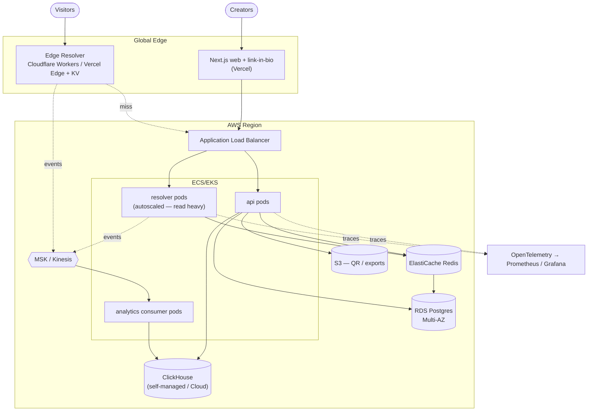

# Linkly — Architecture

Diagrams + **Architecture Decision Records (ADRs)** for the Linkly platform.
Diagrams are [Mermaid](https://mermaid.js.org/) and render natively on GitHub.

> **Design thesis:** the product is the *redirect engine + the data it generates*, not the "shorten" form. Every decision below optimizes the **read hot path**, keeps **analytics off it**, and stays **correct under cache staleness** and **safe under abuse**.

**Contents**
1. [System context](#1-system-context)
2. [Component architecture](#2-component-architecture)
3. [Resolve — hot path (edge hit)](#3-resolve--hot-path-edge-hit)
4. [Resolve — cold / complex path (edge miss → origin)](#4-resolve--cold--complex-path-edge-miss--origin)
5. [Create a link (write path)](#5-create-a-link-write-path)
6. [Edit / delete — cache invalidation](#6-edit--delete--cache-invalidation)
7. [Custom domain onboarding + TLS](#7-custom-domain-onboarding--tls)
8. [Analytics pipeline](#8-analytics-pipeline)
9. [Short-code generation (KGS)](#9-short-code-generation-kgs)
10. [Data model](#10-data-model)
11. [Deployment (AWS)](#11-deployment-aws)
12. [Architecture Decision Records](#12-architecture-decision-records-adrs)

---

## 1. System context



---

## 2. Component architecture

The **resolve path** (edge + origin) is physically separate from the **management API** so a viral link can never starve the dashboard (ADR-1). Metadata lives in Postgres; clicks live in ClickHouse (ADR-4, ADR-7).



---

## 3. Resolve — hot path (edge hit)

The 99% case: hot link served entirely at the edge in <10ms; the click event is emitted **after** the redirect and never awaited (ADR-3, ADR-4).



---

## 4. Resolve — cold / complex path (edge miss → origin)

Cold link, or one needing full rule evaluation / password / expiry checks. Origin resolves from Redis→Postgres, then **warms the edge** so the next hit is hot (ADR-3, ADR-8).



---

## 5. Create a link (write path)

Not on the hot path, so it can afford a Safe-Browsing check and code allocation. Codes come from the KGS pool — no collision-retry loop on the write (ADR-2, ADR-9).



---

## 6. Edit / delete — cache invalidation

The correctness-critical path: an edited destination must not keep serving the old URL. Write-through + **active edge purge** + short TTL backstop (ADR-5, ADR-8).

```mermaid
sequenceDiagram
    autonumber
    actor U as User
    participant API as Management API
    participant P as Postgres
    participant R as Redis
    participant E as Edge KV

    U->>API: PATCH /v1/links/{id} {destinationUrl}
    API->>P: UPDATE link
    API->>R: DEL link:{host}:{code}
    API->>E: PURGE key (fan-out to edge locations)
    Note over E: brief eventual-consistency window;<br/>short TTL is the backstop
    API-->>U: 200 updated
    Note over U,E: 302 (never 301) guarantees future clicks<br/>re-resolve through us — analytics + edits keep working
```

---

## 7. Custom domain onboarding + TLS

Branded domains are the #1 paid feature. Ownership is proven via DNS before any cert is issued (prevents cert-mining), then TLS is provisioned per hostname (ADR-6).



---

## 8. Analytics pipeline

Fire-and-forget from the resolver → stream → enrichment → columnar OLAP. An analytics outage can never take down redirects (ADR-4, ADR-7).



**Why ClickHouse:** click analytics are `COUNT / GROUP BY country, day, device` over billions of append-only rows — a columnar store scans only needed columns and compresses hugely; a row store chokes at scale.

---

## 9. Short-code generation (KGS)

The classic interview question, decided: a **Key Generation Service** hands out unique base62 codes from a pre-allocated pool — beating hash-truncate (collisions) and raw auto-increment (enumerable) (ADR-2).



**Properties:** O(1) allocation · no collision retry on the write path · non-sequential ⇒ not enumerable (defends against scraping) · widen code length gracefully as space fills.

---

## 10. Data model

Relational metadata in Postgres; the immutable click fact table in ClickHouse. Uniqueness is `(domain, code)` — two tenants can both own `/launch`.



---

## 11. Deployment (AWS)



---

## 12. Architecture Decision Records (ADRs)

Each is a defensible decision with a real trade-off. *(Mirrors §7 of the project spec.)*

| # | Decision | Why (short) | Key cost / trade-off |
|---|---|---|---|
| **ADR-1** | Redirect resolver is a **separate service** from the management API | Reads outrun writes 100:1+ with a totally different profile; a viral link must not starve the dashboard | Two deployables; shared lookup code must be factored carefully |
| **ADR-2** | Short codes via a **Key Generation Service** (pre-allocated base62), not hash-truncate or raw auto-increment | O(1) allocation, guaranteed unique, **non-enumerable** (shuffled counter) → no scraping, no collision-retry on write | A pool to run + refill; must not re-issue a used key after restart |
| **ADR-3** | **Hybrid** edge KV + Spring Boot origin resolve | Edge = <10ms global for hot links; origin = source of truth + complex/cold links. Defends both the modern-edge and enterprise-JVM story | Two resolve implementations to keep in sync |
| **ADR-4** | Analytics **off the hot path**: fire-and-forget → stream → ClickHouse | Redirect latency/availability must not depend on the analytics store | Eventually consistent (secs); at-least-once ⇒ dedup on `(linkId, ts, ipHash)` |
| **ADR-5** | Default **302** (temporary), not 301 | 301 is cached forever by browsers → analytics silently stop + edits never propagate. 302 keeps every click flowing through us | Marginally less SEO juice (offer 301 opt-in per link) |
| **ADR-6** | Multi-tenant **custom domains** with DNS verification + on-demand per-host TLS | #1 paid feature; issue certs only after proving ownership (anti cert-mining); route by `Host` | Auto cert issuance is an attack surface; DNS-propagation UX is fiddly |
| **ADR-7** | **ClickHouse** for analytics, not Postgres/Timescale | Columnar store scans only needed columns over billions of append-only rows; row store chokes | Extra store; denormalize (no cross-store joins in query) |
| **ADR-8** | Cache invalidation via **write-through + explicit edge purge + short TTL** | An edited link serving the old URL is a correctness bug; TTL alone leaves stale windows too long | Purge fan-out is eventually consistent; brief stale window |
| **ADR-9** | **Safe-Browsing scan** on create + aggressive rate limits | Shorteners are phishing magnets; a blocklisted domain kills the product | External dependency + latency on create (acceptable — not the hot path) |
| **ADR-10** | Smart **routing rules evaluated at resolve time**, A-B with **sticky bucketing** | Rules must run on the hot path near-zero-latency; A-B without sticky buckets corrupts the experiment | Rule logic duplicated edge+origin (see ADR-3); geo accuracy depends on edge provider |
| **ADR-11** | **Next.js App Router** frontend on Vercel, decoupled from the resolver | Sets the modern SaaS aesthetic bar; server components; cheap edge hosting for link-in-bio; shows full-stack range | Second ecosystem (TS); auth spans NextAuth session ↔ API JWT |

> Full narrative form (alternatives considered, "revisit if" triggers) lives in the project spec, §7, in the `random-thoughts` repo.
